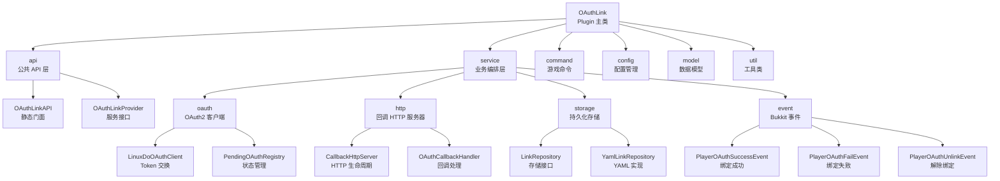

# MC-LinuxDO-OAuth-Link

> Minecraft (Spigot/Paper) 插件 -- LinuxDO 社区 OAuth 账号绑定。

## 项目愿景

为 Minecraft 服务器提供与 LinuxDO 社区的 OAuth2 账户绑定能力。玩家通过浏览器完成 LinuxDO 授权后自动绑定（或使用验证码手动绑定），游戏内使用 `/linkld` 命令管理绑定。下游插件可通过 Bukkit Event 或静态 API 获取绑定状态，实现基于 LinuxDO 身份的权限、称号等扩展功能。

## 架构总览

```text
┌─────────────────────────────────────────────────────────────┐
│                     Minecraft Server                        │
│  ┌──────────┐  ┌──────────┐  ┌───────────────────────────┐ │
│  │ /linkld  │  │ /oauthlink │  │ Downstream Plugins        │ │
│  │ Command  │  │ Command  │  │ (listen to Events / API)  │ │
│  └────┬─────┘  └────┬─────┘  └──────────┬────────────────┘ │
│       │             │                   │                   │
│       ▼             ▼                   ▼                   │
│  ┌──────────────────────────────────────────────────────┐  │
│  │            OAuthLinkService                     │  │
│  │  (Business Orchestrator + OAuthLinkProvider)    │  │
│  └──┬───────┬────────┬────────┬────────┬───────────────┘  │
│     │       │        │        │        │                   │
│     ▼       ▼        ▼        ▼        ▼                   │
│  ┌──────┐ ┌──────┐ ┌──────┐ ┌──────┐ ┌────────────────┐  │
│  │Config│ │OAuth │ │Repo  │ │Event │ │Callback Server  │  │
│  │      │ │Client│ │(YAML)│ │Bus   │ │(Embedded HTTP)  │  │
│  └──────┘ └──┬───┘ └──────┘ └──────┘ └───────┬────────┘  │
│              │                                │            │
└──────────────┼────────────────────────────────┼────────────┘
               │                                │
               ▼                                ▲
         ┌──────────┐              OAuth2 Callback
         │ LinuxDO  │ (authorization_code flow)
         │ Connect  │
         └──────────┘
```

### 绑定流程

```
玩家  /linkld  →  生成 OAuth URL  →  浏览器授权  →  回调自动绑定（默认）
                                                    ↓ 失败则降级
                                                 显示验证码 → /linkld <code> 手动绑定
```

### 关键技术决策

| 决策 | 选择 | 理由 |
| :--- | :--- | :--- |
| HTTP 客户端 | `java.net.http.HttpClient` | JDK 内置，无需额外依赖 |
| 回调服务器 | `com.sun.net.httpserver.HttpServer` | JDK 内置，轻量级 |
| 序列化 | Jackson (shaded) | 可靠的 JSON 处理 |
| 存储 | YAML (Bukkit YamlConfiguration) | 与 Minecraft 生态一致，人类可读 |
| 并发模型 | `CompletableFuture` + 单线程 I/O Executor | 非阻塞 I/O，避免占用主线程 |
| API 暴露 | Bukkit ServicesManager + 静态门面 | 双重访问路径，兼容性好 |
| 安全 | Token 不通过 API 暴露，CSRF state 验证 | 最小权限原则 |

## 模块结构图



## 模块索引

| 包路径 | 职责 | 关键文件 |
| :--- | :--- | :--- |
| `oauthlink` | 插件入口，生命周期管理，依赖注入组装 | `OAuthLink.java` |
| `api` | 下游插件公共 API（静态门面 + 服务接口） | `OAuthLinkAPI.java`, `OAuthLinkProvider.java` |
| `service` | 核心业务编排，实现 OAuthLinkProvider，管理绑定/解绑/事件触发 | `OAuthLinkService.java` |
| `oauth` | LinuxDO OAuth2 客户端、状态注册表、错误体系 | `LinuxDoOAuthClient.java`, `PendingOAuthRegistry.java`, `OAuthError.java`, `OAuthException.java` |
| `http` | 内建 HTTP 回调服务器与处理逻辑（自动绑定 + 手动降级） | `CallbackHttpServer.java`, `OAuthCallbackHandler.java` |
| `storage` | 账号绑定持久化（接口 + YAML 原子写入实现） | `LinkRepository.java`, `YamlLinkRepository.java` |
| `command` | 游戏内命令（`/linkld` 绑定/解绑/信息, `/oauthlink` 管理） | `LinkCommand.java`, `OAuthLinkCommand.java` |
| `event` | Bukkit 事件（绑定成功/失败/解除绑定） | `PlayerOAuthSuccessEvent.java`, `PlayerOAuthFailEvent.java`, `PlayerOAuthUnlinkEvent.java` |
| `config` | 配置加载与校验（含 sentinel 值检测） | `OAuthConfig.java` |
| `model` | 数据记录（DTO），含 rawProfileJson 可扩展字段 | `LinkedAccount.java`, `LinuxDoProfile.java`, `OAuthTokens.java`, `PendingAuthorization.java` |
| `util` | 安全随机码生成（state + linkCode） | `OAuthCodeGenerator.java` |

## 运行与开发

### 环境要求

- **JDK 17+**
- **Gradle 9.3.0**（通过 wrapper 自动下载）
- **Minecraft Spigot/Paper 1.20.x**

### 构建

```bash
# Windows
gradlew.bat build

# Linux/macOS
./gradlew build
```

构建产物: `build/libs/MC-LinuxDO-OAuth-Link-1.0-SNAPSHOT.jar`（shadowJar，含 relocated Jackson）

### 测试

```bash
./gradlew test
```

使用 JUnit 5 + Mockito，详见下方测试策略。

### 配置

1. 前往 [LinuxDO Connect](https://connect.linux.do/) 注册 OAuth 应用
2. 将 `client-id` 和 `client-secret` 填入 `plugins/OAuthLink/config.yml`
3. 确保回调地址 `redirect-uri` 与注册时一致（默认 `http://127.0.0.1:2790/oauth/callback`）

### 关键配置项

```yaml
oauth:
  client-id: ""                    # 必填，LinuxDO 应用 ID
  client-secret: ""                # 必填，LinuxDO 应用密钥
  authorization-url: "https://connect.linux.do/oauth2/authorize"
  token-url: "https://connect.linux.do/oauth2/token"
  user-info-url: "https://connect.linux.do/api/user"
  redirect-uri: "http://127.0.0.1:2790/oauth/callback"
callback:
  host: "127.0.0.1"               # 回调监听地址
  port: 2790                       # 回调端口，避免冲突
  path: "/oauth/callback"          # 回调路径
security:
  state-ttl-seconds: 300           # OAuth state 有效期
  link-code-ttl-seconds: 300       # 验证码有效期
  token-expiry-skew-seconds: 60    # Token 过期容忍偏差
storage:
  file: "data.yml"                 # 绑定数据存储文件
```

## 测试策略

**当前状态：10 个测试文件，覆盖核心模块。**

| 测试文件 | 覆盖模块 | 测试类型 |
| :--- | :--- | :--- |
| `OAuthCodeGeneratorTest` | `util` | 单元测试（7 个用例） |
| `OAuthConfigTest` | `config` | 单元测试 + Mockito（15 个用例） |
| `OAuthErrorTest` | `oauth` | 单元测试 |
| `OAuthExceptionTest` | `oauth` | 单元测试 |
| `PendingOAuthRegistryTest` | `oauth` | 单元测试（状态机逻辑，固定 Clock） |
| `LinkedAccountTest` | `model` | 单元测试 |
| `LinuxDoProfileTest` | `model` | 单元测试 |
| `OAuthTokensTest` | `model` | 单元测试 |
| `PendingAuthorizationTest` | `model` | 单元测试 |
| `YamlLinkRepositoryTest` | `storage` | 集成测试（TempDir + 并发） |

**未覆盖模块：**
- `service/OAuthLinkService` -- 需 Bukkit Mock 环境
- `http/CallbackHttpServer` -- 需真实端口绑定
- `http/OAuthCallbackHandler` -- 需 HTTP 集成测试框架
- `command/LinkCommand` -- 需 Bukkit Mock + 玩家模拟
- `command/OAuthLinkCommand` -- 需 Bukkit Mock
- `oauth/LinuxDoOAuthClient` -- 需 WireMock/HTTP mock
- `event/*` -- 纯 POJO，低优先级

**已知缺陷：** `PendingOAuthRegistryTest` 使用旧版 API（`createState()` 无参数），与当前 `createState(UUID, String)` 签名不匹配，需更新。

### 推荐测试分层

| 层级 | 范围 | 工具建议 |
| :--- | :--- | :--- |
| 单元测试 | 纯逻辑类（已完成大部分） | JUnit 5 |
| 集成测试 | OAuthConfig 验证、YamlLinkRepository 读写（已完成） | JUnit 5 + Bukkit Mock |
| 组件测试 | CallbackHttpServer 启停、OAuthCallbackHandler | JUnit 5 + WireMock |
| 手动测试 | 完整 OAuth 回调流程 | 真实 Spigot 环境 |

## 编码规范

- **语言：** Java 17
- **构建：** Gradle Kotlin DSL
- **命名：** 包名全小写（`oauthlink`），类名 PascalCase
- **数据结构：** 优先使用 `record`（Java 14+）；`LinkedAccount` 含 `rawProfileJson` 供下游解析任意字段
- **并发：** I/O 操作通过 `ExecutorService` 异步执行；共享状态使用 `ConcurrentHashMap`
- **错误处理：** 使用类型化 `OAuthException`，包含 `OAuthError` 枚举和玩家安全消息
- **安全约束：** Access Token 绝不通过公共 API 暴露；`LinkedAccount` record 不含 token；CSRF state 一次性消费

## AI 使用指引

- 修改 HTTP 通信相关代码（`LinuxDoOAuthClient`, `OAuthCallbackHandler`）时，注意异步回调链的异常传播
- 修改存储层时，确保 `YamlLinkRepository` 的原子写入（temp-file + ATOMIC_MOVE）不被破坏
- 添加新的公共 API 方法时，同步更新 `OAuthLinkAPI` 静态门面和 `OAuthLinkProvider` 接口
- 配置项变更需同步更新 `config.yml` 默认值和 `OAuthConfig` 类
- 新增 Bukkit 事件时，参考 `PlayerOAuthUnlinkEvent` 模式（继承 Event，使用 HandlerList，可选 Cancellable）
- `LinkedAccount.rawProfileJson()` 存储完整 user-info 响应，下游可从中提取任意字段；修改 `LinuxDoProfile` 解析逻辑时确保不影响已有持久化数据

## 变更记录 (Changelog)

| 日期 | 版本 | 变更 |
| :--- | :--- | :--- |
| 2026-06-01 | -- | 增量扫描更新：新增 10 个测试文件、PlayerOAuthUnlinkEvent、LinkedAccount 扩展字段（trustLevel/likesReceived/rawProfileJson/displayName）、/linkld 命令重命名、自动绑定流程、手动静默降级 |
| 2026-06-01 | -- | 初始化架构文档（CLAUDE.md），扫描 22 个 Java 源文件 |
| 2026-06 | 1.0-SNAPSHOT | 初始版本：OAuth2 授权码流程、内建 HTTP 回调服务器、YAML 持久化、Bukkit API |

## .context 项目上下文

> 项目使用 `.context/` 管理开发决策上下文。

- 编码规范：`.context/prefs/coding-style.md`
- 工作流规则：`.context/prefs/workflow.md`
- 决策历史：`.context/history/commits.md`

**规则**：修改代码前必读 prefs/，做决策时按 workflow.md 规则记录日志。
